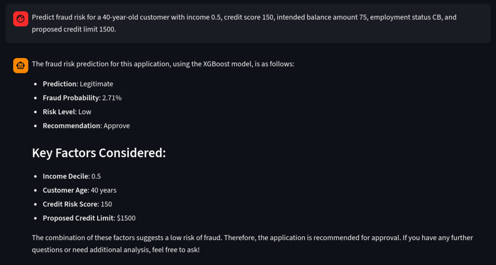
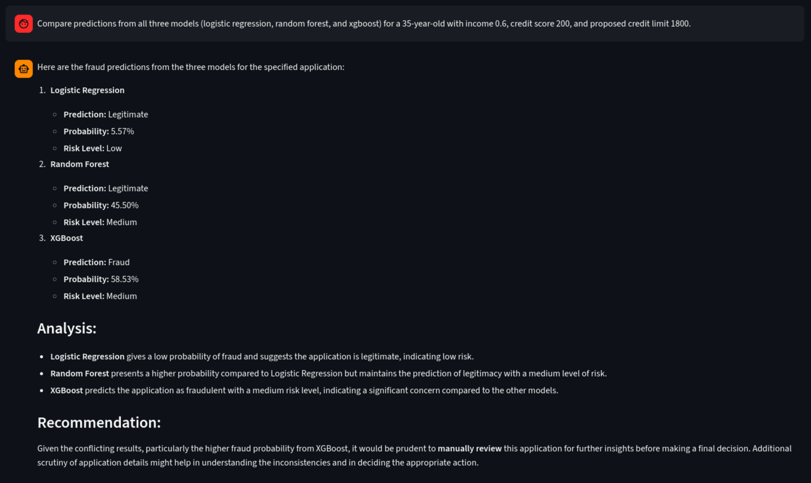
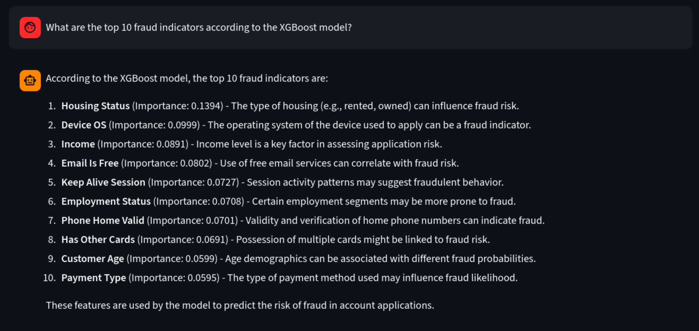
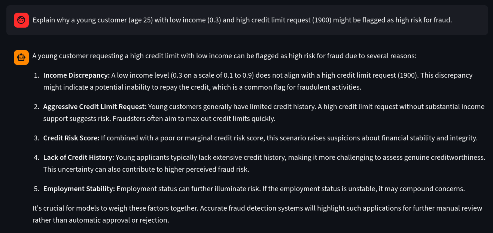
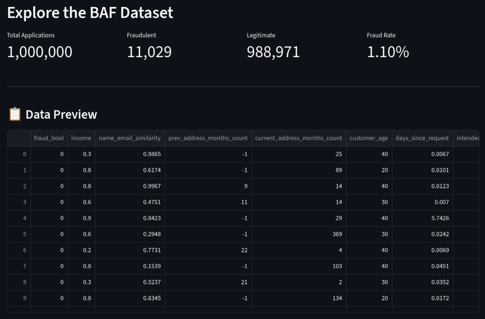
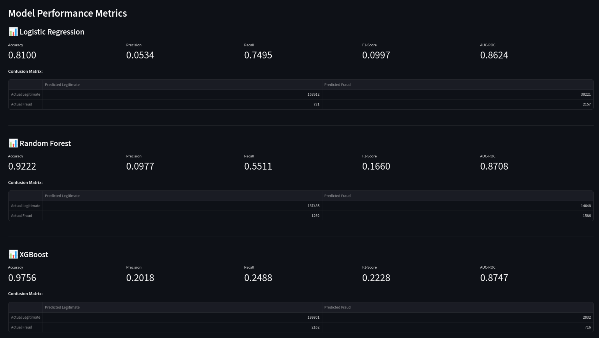
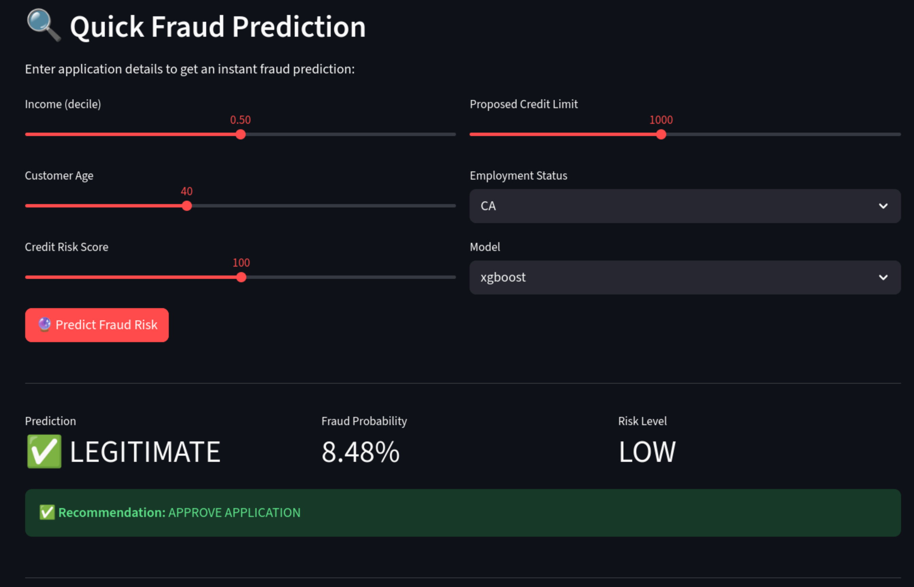

# Bank Account Fraud Detection with AI Agents

An intelligent fraud detection system powered by OpenAI Agents SDK, scikit-learn, and Streamlit. This project uses the Bank Account Fraud (BAF) dataset to train machine learning models and provides an AI assistant for fraud analysis.

## Features

- 🤖 **AI-Powered Analysis**: Chat with an intelligent agent about fraud detection
- 📊 **Multiple ML Models**: Logistic Regression, Random Forest, XGBoost
- 🎯 **Real-time Predictions**: Instant fraud risk assessment
- 📈 **Performance Metrics**: Detailed model evaluation and comparisons
- 🔍 **Dataset Explorer**: Interactive data visualization and statistics
- ⚖️ **Bias Analysis**: Support for multiple dataset variants with induced biases

## 📸 Screenshots

### 🤖 AI Chat Assistant
The intelligent agent answers questions about fraud detection, makes predictions, and explains model decisions.


*Single application fraud prediction with detailed risk analysis*


*Comparing predictions across all three ML models*


*Top fraud indicators according to the XGBoost model*


*Detailed explanation of risk factors for high-risk profiles*

### 📊 Dataset Explorer
Explore the 1M+ bank account applications with rich statistical insights.



### 📈 Model Performance
Comprehensive performance metrics for all trained models.



### 🔍 Quick Predict
Instant fraud predictions with a slider interface.



## Installation

### Prerequisites
- Python 3.13+
- OpenAI API key

### Setup

1. **Clone/create the project**

2. **Download the BAF dataset**
```bash
curl -L -o data/archive.zip \
  https://www.kaggle.com/api/v1/datasets/download/sgpjesus/bank-account-fraud-dataset-neurips-2022
```

> **Note:** This downloads ~500MB of data. The zip file will be automatically extracted when you first load the dataset in the app.

**Alternative:** If the curl command doesn't work, you can:
- Visit [Kaggle Dataset Page](https://www.kaggle.com/datasets/sgpjesus/bank-account-fraud-dataset-neurips-2022)
- Download manually
- Move the zip file to `data/archive.zip`

2. **Create virtual environment**:
```bash
python -m venv .venv
source .venv/bin/activate  # On Windows: .venv\Scripts\activate
```

3. **Install dependencies**:
```bash
pip install -r requirements.txt
```

4. **Set up environment variables**:
```bash
cp .env.example .env
# Edit .env and add your OpenAI API key
```

## Usage

1. **Start the Streamlit app**:
```bash
streamlit run src/app.py
```

2. **In the browser**:
   - Use the sidebar to load the dataset
   - Train the ML models
   - Interact with the AI agent in the chat interface
   - Explore the dataset and model performance

## Project Structure
```
fraud-detection-agent/
├── data/
│   └── archive.zip          # BAF dataset
├── src/
│   ├── __init__.py
│   ├── data_loader.py       # Dataset loading and preprocessing
│   ├── models.py            # ML model training and inference
│   ├── fraud_agents.py      # OpenAI agent definitions
│   └── app.py               # Streamlit application
├── models_cache/            # Saved trained models
├── requirements.txt
├── .env.example
└── README.md
```

## Dataset

The Bank Account Fraud (BAF) suite contains 6 datasets:
- **Base**: No induced bias
- **Variants I-V**: Different types of bias (group size, prevalence, separability)

Each dataset contains 1M synthetic bank account applications with 30 features.

More information about the dataset can be found in the [BAF Dataset Suite Datasheet](https://github.com/feedzai/bank-account-fraud/blob/main/documents/datasheet.pdf)

## Models

The system trains three models:
1. **Logistic Regression**: Fast, interpretable baseline
2. **Random Forest**: Ensemble method for robust predictions
3. **XGBoost**: Gradient boosting for high performance

## Example Queries

Try asking the AI agent:
- "Predict fraud risk for a 40-year-old with income 0.5 and credit score 150"
- "Compare all three models for the same application"
- "What are the top fraud indicators?"
- "Show me the model performance metrics"

## License

This project uses the BAF dataset under Creative Commons CC BY-NC-ND 4.0 license.